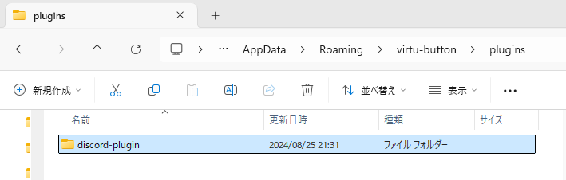
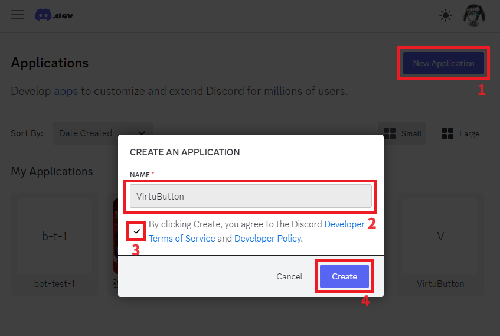
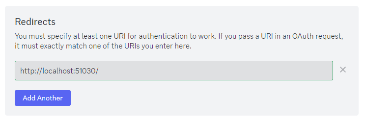
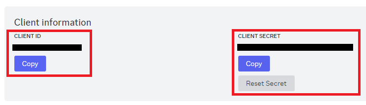

# Discordプラグイン(VirtuButton)

VirtuButtonをDiscordと連携させるプラグインです。

Discord関連のボタンとアクション、イベントが追加されます。

## 使い方

### インストール

VirtuButtonのプラグインフォルダにダウンロードしたzip解凍して配置します。

`C:\Users\[ユーザー名]\AppData\Roaming\virtu-button\plugins\`



プラグインを使用するには[Discord Developer Portal](https://discord.com/developers/applications)で新しくアプリケーションを作成し、キーを発行する必要があります。

### キーを入力

`discord-X.X.X`フォルダ内にある`key.json`に「CLIENT ID」と「CLIENT SECRET」を入力して保存します。

キーの発行方法は下記を参照してください。

### キーの発行方法

### 1. Discordアプリケーションの作成

[Discord Developer Portal](https://discord.com/developers/applications)に使用しているDiscordアカウントでログインして新しくアプリケーションを作成します。

右上の「New Application」ボタンから作成できます。



### 2. リダイレクト先の設定

左側のナビゲーションから「SETTINGS > OAuth2」ページに進みます。

「Redirects」項目の「Add Another」ボタンを押してリダイレクト先に下記のURLを追加します。

```txt:追加するURL
http://localhost:51030/
```


### 3. CLIENT_IDとCLIENT_SECRETを確認する

「SETTINGS > OAuth2」ページの「Client information」項目にあります。

CLIENT_SECRETは見えなくなっているので「Reset Secret」ボタンから再生成することで見えるようになります。




## ライセンス

MIT

## 著者

Reona Oshima (totoraj)

X(Twitter): [@totoraj_game](https://x.com/totoraj_game)