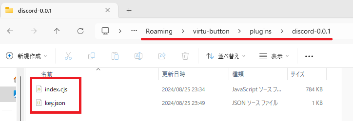

# Discordプラグイン(VirtuButton)

VirtuButtonをDiscordと連携させるプラグインです。

Discord関連のボタンとアクション、イベントが追加されます。

## 使い方

### インストール

VirtuButtonのプラグインフォルダにダウンロードしたzip解凍して配置します。

`C:\Users\[ユーザー名]\AppData\Roaming\virtu-button\plugins\`

プラグインを使用するには[Discord Developer Portal](https://discord.com/developers/applications)で新しくアプリケーションを作成し、キーを発行する必要があります。

### キーを入力

`discord-plugin`フォルダ内にある`key.json`に「CLIENT ID」と「CLIENT SECRET」を入力して保存します。

キーの発行方法は下記を参照してください。

### キーの発行方法

画像の手順でDiscordアプリケーションを登録することで「CLIENT ID」と「CLIENT SECRET」を発行できます。

使用したいDiscordのアカウントでログインして登録を行う必要があります。

別のアカウントでも使用したい場合は「Application Testers」から対象のアカウントに対してInvite(招待)を送信する必要があります。